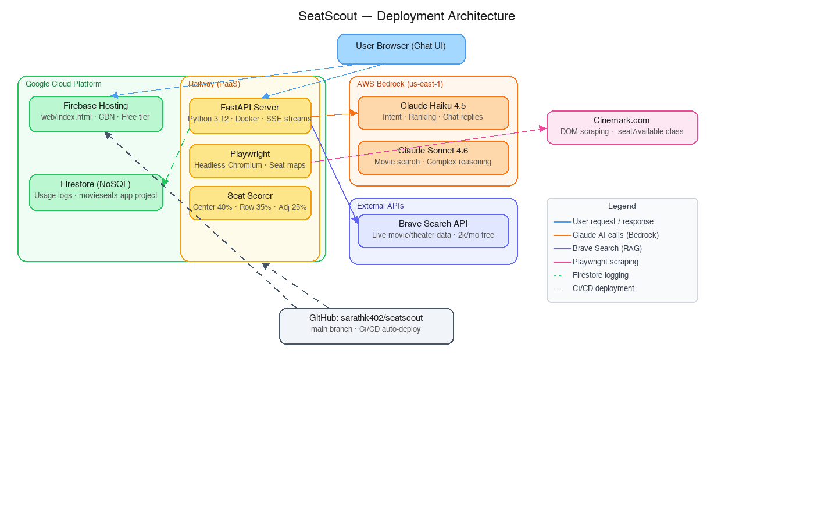

# SeatScout

**Find the best available movie theater seats near you — powered by AI.**

SeatScout is an open-source tool that scans real theater websites, checks seat availability in real-time, and recommends the best seats based on position, row depth, and format. It works through a simple chat interface — just type what you want to watch and where.

## How It Works

```
You:  "Dhurandhar tomorrow evening near 75035, 2 tickets"

SeatScout scans 5 theaters, 15 showtimes in ~35 seconds...

★ Cinemark West Plano XD
  9:15 PM · Standard · $14.00
  93/162 seats available
  Best seats: D11, D12
  Row D center, 40% back from screen

  → Buy Tickets

  On Cinemark's page, look for Row D, seats 11 and 12
```

## Features

- **Natural language search** — type like you're texting a friend
- **Real-time seat availability** — checks actual theater seat maps
- **Smart scoring** — ranks seats by center position (40%), row depth (35%), and adjacency (25%)
- **AI recommendations** — explains why a seat is good and what to avoid
- **Price info** — shows ticket prices per showtime
- **Format preference** — ask for IMAX, XD, cheapest, or standard
- **Browse movies** — "what's playing near 75035?" shows all movies
- **Conversational follow-ups** — "how about morning?" changes the search
- **Buy tickets link** — opens the theater's seat selection page directly
- **CLI and web interface** — use from terminal or browser

## Supported Theaters

| Chain | Status | Coverage |
|-------|--------|----------|
| Cinemark | Working | 525+ theaters, 41 US states |
| AMC | Coming soon (API key approved, activates Thursday weekly) | 860+ theaters |
| Marcus | Partial | ~90 theaters, Midwest |
| Regal | Blocked (Cloudflare) | — |

## Quick Start

### Prerequisites

- Python 3.10+
- AWS credentials with Bedrock access (via `~/.aws/credentials`, env vars, or IAM role)
- A [Brave Search API key](https://brave.com/search/api) (free tier: 2,000 queries/month)

### Installation

```bash
# Clone the repo
git clone https://github.com/sarathk402/seatscout.git
cd seatscout

# Install dependencies
pip install -r requirements.txt
pip install fastapi uvicorn

# Install browser for seat map scanning
playwright install chromium

# Set up environment variables
cp .env.example .env
# Edit .env and add your BRAVE_API_KEY (AWS credentials are picked up automatically)
```

### Run the Web App

```bash
python server.py
```

Open http://localhost:8000 in your browser.

### Run from Command Line

```bash
# Basic search
python main.py --zipcode 75035 --movie "Dhurandhar" --seats 2

# Morning shows
python main.py -z 75024 -m "Project Hail Mary" -s 3 --date 22 --time morning

# All showtimes, skip AI
python main.py -z 90001 -m "Hoppers" --time all --no-ai
```

### CLI Options

```
--zipcode, -z    US zipcode (required)
--movie, -m      Movie name (required)
--seats, -s      Number of seats (default: 2)
--date, -d       Date to search (e.g., "22" for the 22nd, default: today)
--time, -t       Time preference: morning, afternoon, evening, all (default: evening)
--no-ai          Skip AI recommendation (faster)
--verbose, -v    Show detailed logs
```

## Chat Examples

The web interface understands natural language:

```
"Dhurandhar tomorrow evening near 75035"
"what's playing near 75024?"
"Project Hail Mary morning shows near Plano, 3 tickets"
"cheapest option for Hoppers near 90001"
"IMAX showing of Scream 7 near 75035"
"how about morning shows?"          ← follows up on previous search
"check Monday instead"              ← changes date
"3 tickets"                         ← changes seat count
"try XD format"                     ← changes format preference
```

## How Seat Scoring Works

Each seat is scored from 0 to 1.25:

| Factor | Weight | Best Score |
|--------|--------|------------|
| Center position | 40% | Dead center of the row |
| Row depth | 35% | ~65% back from the screen |
| Adjacency | 25% | All seats together in a row |

The ideal seat is **center of the row, about 2/3 back from the screen** — close enough to see detail, far enough to take in the full frame.

## Architecture



*Firebase Hosting serves the frontend · Railway runs the FastAPI backend · AWS Bedrock powers Claude AI · Brave Search provides live movie data · Playwright scrapes Cinemark seat maps*

```
User message
    │
    ▼
Claude AI (parse intent)     ← understands "tomorrow morning near Plano"
    │
    ▼
Playwright browser
    ├── Find movie on Cinemark.com
    ├── Enter zipcode
    ├── Extract showtime links (TheaterId, ShowtimeId)
    └── Open seat map pages in parallel (6 tabs)
        └── Parse DOM: .seatAvailable / .seatUnavailable
    │
    ▼
Seat Scorer (Python math)   ← center + row + adjacency scoring
    │
    ▼
Claude AI (recommendation)  ← "Grab D11, D12 at West Plano XD"
    │
    ▼
Results displayed in chat with Buy Tickets link
```

### How Seat Extraction Works

We don't use screenshots or AI vision to read seat maps. Instead:

1. Open the theater's seat map page in a headless browser
2. Wait for seats to load (JavaScript rendering)
3. Parse the DOM directly:
   - `seatAvailable` class → available (green) seat
   - `seatUnavailable` class → taken (gray) seat
   - `seatBlank` class → aisle/empty space
   - `title="Available Seat D10"` → exact row and seat number
4. Skip wheelchair-only rows from scoring
5. Score all available seats mathematically

This gives **100% accurate seat data** — no AI hallucinations, no vision errors.

## Project Structure

```
seats/
├── server.py                    # FastAPI web server with chat API
├── main.py                      # CLI entry point
├── config.py                    # Settings and constants
├── web/
│   └── index.html               # Chat interface (single file)
├── seats/
│   ├── brain.py                 # Claude AI for recommendations
│   ├── fetcher/
│   │   ├── theaters.py          # Find theaters + showtimes
│   │   ├── seats.py             # Extract seat maps from DOM
│   │   └── browse.py            # Browse all movies near zipcode
│   ├── seats/
│   │   ├── models.py            # Pydantic data models
│   │   ├── scorer.py            # Seat scoring algorithm
│   │   └── parser.py            # Parse seat map responses
│   ├── chains/                  # Theater chain configs
│   │   ├── cinemark.py
│   │   ├── amc.py
│   │   └── fandango.py
│   ├── browser/                 # Playwright browser management
│   │   ├── session.py
│   │   ├── actions.py
│   │   └── stealth.py
│   └── agent/                   # v1 vision-based agent (legacy)
│       ├── loop.py
│       ├── prompts.py
│       └── vision.py
├── tests/
│   ├── test_scorer.py
│   └── test_models.py
├── Dockerfile                   # For Railway/cloud deployment
├── railway.json                 # Railway platform config
└── requirements.txt
```

## Deployment

### Railway (Recommended)

1. Fork this repo
2. Go to [Railway](https://railway.app) → New Project → Deploy from GitHub
3. Select your forked repo
4. Add environment variables: `AWS_ACCESS_KEY_ID`, `AWS_SECRET_ACCESS_KEY`, `AWS_REGION`, `BRAVE_API_KEY`
5. Railway auto-builds and deploys

### Docker

```bash
docker build -t seatscout .
docker run -p 8000:8000 seatscout
```

### Manual

```bash
pip install -r requirements.txt fastapi uvicorn
playwright install chromium
export AWS_ACCESS_KEY_ID=your-key
export AWS_SECRET_ACCESS_KEY=your-secret
export AWS_REGION=us-east-1
export BRAVE_API_KEY=your-brave-key
python server.py
```

## Environment Variables

| Variable | Required | Description |
|----------|----------|-------------|
| `AWS_ACCESS_KEY_ID` | Yes* | AWS credentials for Bedrock access |
| `AWS_SECRET_ACCESS_KEY` | Yes* | AWS credentials for Bedrock access |
| `AWS_SESSION_TOKEN` | No | Required if using temporary/SSO credentials |
| `AWS_REGION` | No | AWS region for Bedrock (default: `us-east-1`) |
| `BRAVE_API_KEY` | Recommended | [Brave Search API](https://brave.com/search/api) key for live movie data |
| `PORT` | No | Server port (default: 8000) |
| `HEADLESS` | No | Run browser headless (default: true) |

*Not required if using `~/.aws/credentials`, an IAM role, or AWS SSO (`aws sso login`).

## Cost

- **AWS Bedrock**: ~$0.01-0.02 per search (Claude Haiku for intent/ranking, Sonnet for movie resolution)
- **Brave Search**: Free tier covers 2,000 queries/month; $5/1,000 after that
- **Infrastructure**: Free on Railway's starter plan
- **Theater data**: Free (no API keys needed for Cinemark)

## Limitations

- **Cinemark only** (for now) — AMC integration pending API key activation
- **~35 seconds per search** — limited by Playwright browser automation
- **US theaters only** — international support would need chain-specific configs
- **No real-time refresh** — re-search to get updated availability
- **Seat numbers may differ slightly** — Cinemark shows seats right-to-left, we recommend by seat number

## Roadmap

- [ ] AMC integration (API key activates weekly on Thursdays)
- [ ] Faster search with caching (target: 10 seconds)
- [ ] Mobile-friendly layout
- [ ] Regal support (needs Cloudflare bypass)
- [ ] Seat map visual in chat
- [ ] Sold-out alerts
- [ ] User preferences (save favorite theaters)
- [ ] Multi-movie comparison

## Contributing

Contributions welcome! Areas where help is needed:

1. **New theater chains** — add parsers for AMC, Regal, Marcus, Harkins, etc.
2. **Speed optimization** — caching, parallel requests, reduce browser usage
3. **Mobile UI** — make the chat interface responsive
4. **Testing** — add integration tests for seat extraction
5. **International support** — add theater chains from other countries

### Adding a New Theater Chain

1. Create `seats/fetcher/newchain.py`
2. Implement theater discovery (find showtimes near zipcode)
3. Implement seat extraction (parse DOM for available/taken seats)
4. The seat must return `Seat(row, number, status)` — the scorer handles the rest

## License

MIT License — use it however you want.

## Acknowledgments

Built with:
- [AWS Bedrock](https://aws.amazon.com/bedrock) — Claude AI via Bedrock for natural language understanding and recommendations
- [Brave Search](https://brave.com/search/api) — live web search for movie and theater data
- [Playwright](https://playwright.dev) — browser automation for seat map extraction
- [FastAPI](https://fastapi.tiangolo.com) — web server
- [Rich](https://rich.readthedocs.io) — terminal output formatting
